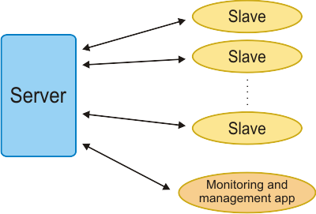

BrowserDriver's development started as a project aiming to simplify writing and running automated UI tests in JavaScript and this is what it is mostly used for. It does not offer a complete set of testing tools but only the base infrastructure needed to allow automated or manual execution of JavaScript in one or more web browsers and communicating back the results. The specifics of running tests or just fiddling with a website are left off to test libraries or utilities. The environment is built in a very modular fashion and in fact even the browser is not a necessary component – anything that could connect to the server and impersonate a slave instance will be accepted.



Everything is written in JS so should be very easy for anyone, using BrowserDriver to test their JS code, to understand its inner details and suggest or implement extensions or fix bugs. It’s built around a central [server](The-server) which should be able on its own to fire up browser instances and load and run the necessary tests as specified in a configuration file and/or with command line arguments.

The server can run with default settings but this will hardly be useful and is at least inconvenient so it is strongly advised to write and use a [configuration file](Configuration-file) when starting the server:

    browser-driver configFileName="path/to/xxx.conf.json"

This will help with organizing the scripts in directories and will allow customizing the server.

The server is able to automatically start browsers and execute tests when upon start up. If browsers can not be launched by the server (if for example they need to run on another machine) they may be started manually and when directed to the slave capture url they will start executing scheduled tests right away. Tests can also be run interactively by the user from the [management console](Management-console).

## Writing tests

BrowserDriver does not impose a syntax for writing tests because it will not run them directly. To write a test one needs to stick with the rules of the selected testing library (currently the only one supported is QUnit). So a typical test could look like this:
```js
asyncTest("UI test", function (){
	expect(2);
	ok(true, "one successfull assertion");
	setTimeout(function (){
		ok(true, "another successfull assertion");
		start(); // finish this test
	}, 1000);
});
```
And in addition the test code can make use of all functionality that the environment provides on the [slave](Slaves).

When the script files become quite complex BrowserDriver allows frequently used, independed utility code to be put in separate reusable files. Tests then only need to mark their dependency on such libraries and the execution environment will make sure the libraries are loaded before dependent tests are run. If for example we had some useful code in the file util.js a test will request that file to be loaded like this:
```js
driver.loadLib("util"); // load this code library before executing the following tests
test("UI test", function (){
	someUtilityFunction(); // call a function from the util.js file included above
	ok(true, "one successfull assertion");
});
```
